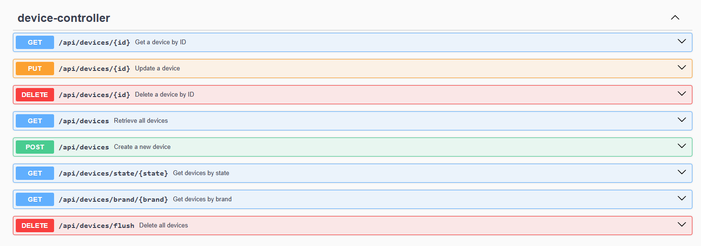

# Device Management API

This project is a Spring Boot application that provides a RESTful API for managing devices. It allows you to create, retrieve, update, and delete devices, as well as fetch devices by brand and state.

## Features

- Create a new device
- Retrieve all devices
- Retrieve a device by ID
- Update a device
- Delete a device
- Retrieve devices by brand
- Retrieve devices by state

## Prerequisites

- Java 22 
- Maven
- Frameworks 
  - Spring Boot 3
  - Flyway / Lombok / Log4j2
  - Mockito / JUnit 5
  - OpenAPI/Swagger
- PostgreSQL 16
- Docker / Docker Compose

## Getting Started

### Build and Run the Application

1. **Clone the repository:**
   ```sh
   git clone https://github.com/cristianogregio/device-management-api.git
   cd device-management-api

    ```
   
   2. **Build the application:** 
      ```sh
      mvn clean install
      ```
      

3. **Run the application:** 
   ```sh
   java -jar target/device-management-api-1.0-SNAPSHOT.jar
   ```
   
   The application will start on port 8080.
 

### Run the Application with Docker
    

1. **Build the Docker image:**
   ```sh
   docker build -t device-management-api .
   ```
    

2. **Run the Docker container:**
   ```sh
    docker run -p 8080:8080 device-management-api
    ```

The application will start on port 8080.

### Run the Application with Docker Compose

1. **Build the Docker image:**
   ```sh
   docker-compose build
   ```
   

2. **Run the Docker container:**
   ```sh
    docker-compose up
    ```
## API Documentation

When the application is running, you can access the API documentation at http://localhost:8080/swagger-ui/index.htm.



